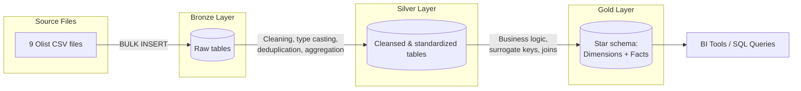
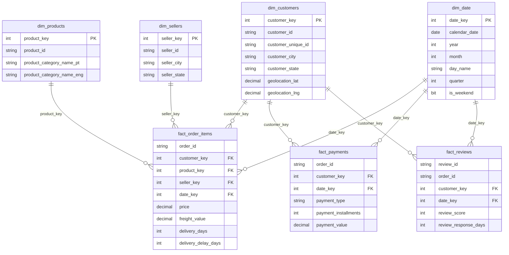

# E-Commerce-SQL-


# E-Commerce Data Warehouse (SQL Server ETL Project)

A Bronze → Silver → Gold data warehouse built on SQL Server, transforming raw Brazilian e-commerce transaction data into a business-ready dimensional model for analytics and reporting.

---

## Business Problem

E-commerce platforms generate transactional data across multiple disconnected systems — customers, orders, payments, logistics, and reviews. Raw, siloed data like this cannot be queried efficiently or reliably for business reporting: it contains inconsistent formatting, missing values, and no unified structure connecting customer behavior to sales, delivery performance, and satisfaction.

This project builds a structured data warehouse that consolidates nine raw source files into a clean, connected, analysis-ready model — answering the kind of questions a Business Analyst or Data Analyst would be asked to support: revenue trends, delivery performance, payment behavior, and customer satisfaction.

## Project Objectives

- Design and implement a multi-layer ETL pipeline (Bronze / Silver / Gold) following data warehousing best practices
- Load raw CSV data into SQL Server reliably, handling real-world file-format issues (encoding, delimiters, embedded characters)
- Clean, standardize, and validate data through a documented, repeatable transformation layer
- Model a star schema (dimensions + facts) suited to analytical querying and BI tool connection
- Document data quality findings and the reasoning behind every cleaning decision, not just the final code

---

## Architecture



### Layer Responsibilities

| Layer | Purpose | Object Type |
|---|---|---|
| **Bronze** | Raw, unmodified copy of source CSVs | Tables |
| **Silver** | Cleaned, standardized, validated data | Tables |
| **Gold** | Business-ready dimensional model | Views (dimensions/facts) + 1 table (`dim_date`) |

**Bronze** — Data is loaded exactly as it exists in the source files via `BULK INSERT`, with no transformation. This preserves an unaltered audit trail of the original data and isolates load-time issues (encoding, delimiters, malformed rows) from business-logic issues.

**Silver** — Bronze data is cleaned and standardized: stray characters stripped, data types enforced, duplicates and invalid values handled, and any necessary aggregation performed (e.g. collapsing the geolocation table). Every transformation decision is documented against the specific data quality issue it addresses.

**Gold** — Silver data is reshaped into a star schema: dimension tables carry descriptive attributes with surrogate keys, and fact views carry business measures joined to those dimensions. Built as views (except the static `dim_date` calendar table) so the Gold layer always reflects the current state of Silver without a separate load step.

---

## Data Source

**[Brazilian E-Commerce Public Dataset by Olist](https://www.kaggle.com/datasets/olistbr/brazilian-ecommerce)** (Kaggle) — real, anonymized order data from Olist Store, a Brazilian marketplace connecting small businesses to major sales channels.

| File | Description | Rows |
|---|---|---|
| `olist_customers_dataset.csv` | Customer identifiers and location | 99,441 |
| `olist_orders_dataset.csv` | Order status and timestamps | 99,441 |
| `olist_order_items_dataset.csv` | Line items per order (product, seller, price, freight) | 112,650 |
| `olist_order_payments_dataset.csv` | Payment method, installments, value | 103,886 |
| `olist_order_reviews_dataset.csv` | Customer review score and timestamps | 99,224 |
| `olist_products_dataset.csv` | Product category and attributes | 32,951 |
| `olist_sellers_dataset.csv` | Seller identifiers and location | 3,095 |
| `olist_geolocation_dataset.csv` | Zip-code-level lat/long coordinates | 1,000,163 |
| `product_category_name_translation.csv` | Portuguese → English category lookup | 71 |

---

## Database & Schema Structure

```
DataWarehouse
├── bronze   -- raw, unmodified source data
├── silver   -- cleansed, standardized data
└── gold     -- dimensional model (views + dim_date table)
```

Each layer is implemented as its own SQL Server schema within a single `DataWarehouse` database, following the medallion architecture pattern.

---

## Gold Layer — Star Schema



**Dimensions:** `dim_customers`, `dim_products`, `dim_sellers`, `dim_date`
**Facts:** `fact_order_items` (item-level: price, freight, delivery performance), `fact_payments` (payment-level: method, installments, value), `fact_reviews` (review-level: score, response time)

`dim_customers` and `dim_date` are conformed dimensions, shared across all three fact tables.

---

## ETL Workflow

1. **`init_database.sql`** — creates the `DataWarehouse` database and the `bronze` / `silver` / `gold` schemas
2. **`Scripts/Bronze/DDL_bronze.sql`** — creates raw landing tables
3. **`Scripts/Bronze/Procedure_load_bronze.sql`** — `bronze.load_bronze` stored procedure, `BULK INSERT`s all 9 source files
4. **`Scripts/Silver/DDL_Silver.sql`** — creates cleansed table structures
5. **`Scripts/Silver/Procedure_load_silver.sql`** — `silver.load_silver` stored procedure, transforms Bronze → Silver
6. **`Scripts/Gold/DDL.gold.sql`** — creates the star schema (views + `dim_date`)

Each load procedure is wrapped in `TRY/CATCH` error handling and prints per-table row-load duration for basic execution logging.

---

## Data Cleaning & Transformation Highlights

- **Encoding & delimiter handling** — source files use a mix of LF and CRLF line endings; `BULK INSERT` row terminators were set per-file (`0x0a` vs `0x0d0a`) after confirming each file's actual format, rather than assuming one default
- **Embedded characters in free text** — `order_reviews` contains commas and literal line breaks inside quoted review text; loaded using `FORMAT = 'CSV'` with `FIELDQUOTE` to parse correctly rather than corrupting row boundaries
- **Quote-qualified fields** — several source files wrap values in double quotes as valid CSV syntax; `TRIM(REPLACE(col, '"', ''))` applied in Silver to strip literal quote characters left behind by the raw load
- **Geolocation aggregation** — the raw geolocation file has ~1,000,163 rows collapsing to ~19,015 unique zip codes (many duplicate/near-duplicate coordinate samples per zip); aggregated to one row per zip (`AVG` lat/lng) in Silver so it can safely be used as a join target without fanning out fact rows. A small number of rows with coordinates outside Brazil's geographic bounds were excluded before aggregating
- **Category translation** — product categories are stored in Portuguese; translated to English via a lookup join, with `COALESCE` fallback to the Portuguese name for the [X] categories with no English translation on record
- **Missing category handling** — [X] products have no category recorded; defaulted to `'uncategorized'` rather than left NULL, so they remain visible in category-based reporting instead of silently dropping out of joins/grouping
- **Implausible values** — a handful of products record `0g` weight despite having real dimensions; converted to NULL via `NULLIF` rather than treated as a valid measurement
- **Non-informative records excluded** — payment rows with `payment_type = 'not_defined'` (and $0 value) were excluded in Silver as uninformative
- **Nulls preserved, not fabricated** — delivery and approval timestamps are left NULL when an order hasn't reached that stage (e.g. canceled orders); no placeholder dates were invented

---

## Data Quality Checks & Findings

| Finding | Handling |
|---|---|
| [X] products missing `product_category_name` | Defaulted to `'uncategorized'` in Silver |
| 2 categories with no English translation | `COALESCE` fallback to Portuguese name |
| [X] customers/sellers with no matching geolocation zip | Left NULL; flagged via `has_geolocation` indicator column |
| [X] orders marked `delivered` with a NULL delivery date | Left as-is; documented as a source-system inconsistency |
| 3 payment rows with `payment_type = 'not_defined'` | Excluded in Silver |
| [X] products with `weight_g = 0` | Converted to NULL via `NULLIF` |
| ~[X] duplicate rows in raw geolocation data | Resolved by aggregation (`GROUP BY` zip) |

All findings were investigated against the raw source data before deciding on a handling approach — no null was filled and no row was dropped without first confirming *why* it was missing.

---

## SQL Techniques Demonstrated

- Stored procedures with structured `TRY/CATCH` error handling and execution logging
- `BULK INSERT` with format-specific handling (`FIELDQUOTE`, `CODEPAGE`, custom `ROWTERMINATOR`)
- Window functions (`ROW_NUMBER()`) for surrogate key generation
- Recursive CTEs (calendar/date dimension generation)
- Aggregation and outlier filtering (`GROUP BY`, `AVG`, range filtering)
- `COALESCE` / `NULLIF` / `ISNULL` for deliberate null-handling logic
- Multi-table joins across a normalized source model into a denormalized star schema
- `CASE WHEN` derived/calculated columns (delivery delay, review response time, data-quality flags)

---

## Performance & Scalability Considerations

- Gold-layer dimensions and facts are implemented as **views**, not materialized tables, so they always reflect the current Silver data without a separate sync step — appropriate at this dataset's scale (largest table ~1M raw rows)
- `dim_date` is the one exception, built as a physical table since calendar data is static and gains nothing from being recomputed per query
- At larger scale, Gold views could be converted to materialized/indexed tables with their own scheduled load step, trading some data freshness for query performance
- [X — note any indexing added, if applicable]

---

## Example Business Questions This Warehouse Can Answer

- What is the month-over-month revenue trend?
- Which product categories generate the most revenue?
- What is the average delivery delay by state, and how does it correlate with review scores?
- How is payment method distributed across order value and installment count?
- What percentage of orders are delivered later than the estimated delivery date?
- How quickly does the platform respond to customer reviews, and does that vary by review score?

---

## Tools & Technologies

- **Database:** Microsoft SQL Server (Express)
- **Client:** SQL Server Management Studio (SSMS)
- **Language:** T-SQL
- **Source data:** CSV (Kaggle)
- **Version control:** Git / GitHub

---

## Project Folder Structure

```
E-Commerce-SQL/
├── Datasets/                      # (raw CSVs — not committed; see Data Source above)
├── Docs/                          # supporting documentation
├── Scripts/
│   ├── init_database.sql          # database + schema creation
│   ├── Bronze/
│   │   ├── DDL_bronze.sql
│   │   └── Procedure_load_bronze.sql
│   ├── Silver/
│   │   ├── DDL_Silver.sql
│   │   └── Procedure_load_silver.sql
│   └── Gold/
│       └── DDL.gold.sql
├── Tests/                         # data quality validation queries
├── README.md
└── LICENSE
```

---

## How to Run This Project

1. Download the [Olist dataset](https://www.kaggle.com/datasets/olistbr/brazilian-ecommerce) from Kaggle and place the CSVs in a local folder
2. Update the file paths inside `Procedure_load_bronze.sql` to point to that folder
3. Run `Scripts/init_database.sql` to create the database and schemas
4. Run `Scripts/Bronze/DDL_bronze.sql`, then `EXEC bronze.load_bronze;`
5. Run `Scripts/Silver/DDL_Silver.sql`, then `EXEC silver.load_silver;`
6. Run `Scripts/Gold/DDL.gold.sql` to build the star schema
7. Query the `gold` schema directly, or connect a BI tool (Power BI / Tableau) to it

---

## Key Learning Outcomes

- Designing and implementing a layered ETL architecture from scratch
- Diagnosing and resolving real-world file-format issues in `BULK INSERT` (encoding, terminators, embedded delimiters)
- Making and documenting deliberate data-quality decisions rather than applying blanket fixes
- Modeling a normalized source dataset into a denormalized star schema
- Writing maintainable, logged, error-handled stored procedures in T-SQL

## Future Improvements

- [ ] Add automated data quality tests (`Tests/` folder)
- [ ] Convert Gold views to indexed/materialized tables with a dedicated load step
- [ ] Build out a Power BI / Tableau dashboard on top of the Gold layer
- [ ] Add incremental (rather than full-refresh) loading logic
- [ ] Add a `fact_order_items`-level product-dimension enrichment (weight/dimensions) if freight-cost analysis becomes in scope

---

## Resume-Ready Project Summary

> Designed and built an end-to-end SQL Server data warehouse for a 100K-order e-commerce dataset, implementing a Bronze/Silver/Gold ETL architecture with stored procedures, error handling, and execution logging. Diagnosed and resolved real-world data-loading issues (encoding, delimiters, embedded characters) and documented data-quality decisions across 9 source tables. Modeled a star schema (4 dimensions, 3 fact views) supporting analysis of sales, delivery performance, payments, and customer reviews.

---

## Author

[SAINATH NILEWAD] — [LinkedIn] · [SainathNilewad] · [Portfolio]
